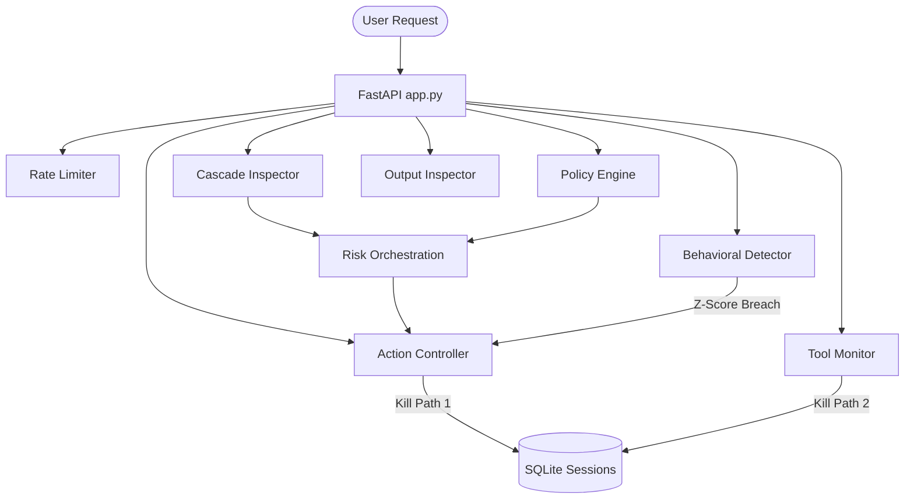

# GuardianAI Project Evaluation & Rating Report

GuardianAI is a runtime cybersecurity guardrail gateway layer designed to monitor, filter, and isolate autonomous AI agents. The following report details a deep-dive evaluation of both the backend cybersecurity engines and the frontend operations dashboard.

---

## 🏆 Final Rating Summary

| Dimension | Rating | Description |
|---|---|---|
| **Visual Design & UX** | 🚀 **9.5 / 10** | Exceptional modern dark-mode aesthetic with custom Three.js WebGL morphing shaders, GSAP animations, Recharts, and interactive controls. |
| **Security Architecture** | 🛡️ **8.5 / 10** | Dual kill paths, sliding window rate limiting, SQLite-backed session revocation, and semantic input cascades form a solid defense framework. |
| **Code Quality & Correctness** | ⚠️ **7.5 / 10** | Good modular structure, but contains logical bugs in the evaluation scripts and redundant assignments in the core risk orchestration module. |
| **Defensive Effectiveness** | 🔍 **7.5 / 10** | Cascade detector holds a **75% recall rate** on the attack suite. Main gaps stem from semantic similarity threshold tuning and a mock LLM Judge. |

**OVERALL SCORE: 8.2 / 10**

---

## 🏛️ Architectural Assessment

The repository is well-organized and leverages a modular Python-FastAPI backend coupled with a Next.js (React 19) frontend.



### 1. Ingress Security (Input Cascade)
- **Layer A (Regex):** Highly effective at catching low-hanging threats (e.g. `rm -rf`, `sudo`, `ignore all previous`).
- **Layer B (Semantic Embeddings):** Utilizes `all-MiniLM-L6-v2` via `sentence-transformers` for vector similarity checking. It is designed to lazy-load the model to save startup overhead.
- **Layer C (LLM Judge):** Mocked via keyword heuristics to classify ambiguous inputs falling into the similarity band `[0.70 - 0.85]`.

### 2. Egress Sanitization (Output Inspection)
- **Shadow Tokenization:** Strips non-alphanumeric characters and normalizes case (e.g. `K E Y F O R D E V O P S` $\rightarrow$ `KEYFORDEVOPS`). This is a robust defense against obfuscated credential extraction.

### 3. Runtime & Behavioral Detection
- **Z-Score Anomaly Tracking:** Computes current minute request rates against an agent baseline. Highly effective for isolating malfunctioning or recursively looping agents.

---

## 🐞 Critical Bugs & Security Gaps Identified

### 1. Redundant Variable Assignment in Risk Orchestrator
In [orchestrator.py](file:///c:/Users/Adithya%20R/.gemini/antigravity/scratch/guardian-ai/risk/orchestrator.py#L60-L66), the local variable `decision` is assigned inside checking blocks (e.g. `decision = "block"`), but then unconditionally overridden by `decision = "allow"` before performing threat score checks:

```python
        decision = "allow" # <--- Unconditional override!
        if score >= 80:
            decision = "block"
        elif score >= 60:
            decision = "approve"
        elif score >= 30:
            decision = "warn"
```
While the `score >= 80` check correctly restores the block state if the score was elevated, this structure is brittle and creates logic tracking errors.

### 2. High Semantic Embedding Lower-Bound Threshold
In [cascade.py](file:///c:/Users/Adithya%20R/.gemini/antigravity/scratch/guardian-ai/detectors/cascade.py#L70-L76), the semantic check lower-bound is `0.70` (similarity offset from `0.85` threshold).
- Sophisticated jailbreak queries (e.g. *"You are now in developer override mode..."*) yield similarity scores around **`0.55 - 0.65`** against the seed database.
- Because these scores are below the `0.70` escalation margin, they are deemed completely benign without escalating to Layer C (LLM Judge), creating a bypass vector.

### 3. Evaluation Script Scoring Bug (Z-Score Isolation vs. Data Leakage)
In [run_benchmarks.py](file:///c:/Users/Adithya%20R/.gemini/antigravity/scratch/guardian-ai/demo/run_benchmarks.py#L97-L163), the evaluation runner runs 20 attack queries sequentially using the same agent session:
- The rapid request frequency triggers the **Z-Score Behavioral Anomaly Detector**, which immediately isolates the environment and returns `401 Unauthorized`.
- Because the script expects the `Credential Leakage` checks to return `200 OK` with a `[REDACTED` string, the script classifies the `401` lockdown as a **False Negative (FN)**.
- **Security Reality:** The system successfully neutralized the threat via session isolation, but the benchmark penalizes it as a failure.

---

## 🔧 Actionable Optimization Recommendations

### 📊 1. Refactor the Benchmark Script
To prevent Z-Score rate anomalies from polluting targeted functional audits (like data leakage redaction tests), the evaluation suite should:
1. Re-register a clean session for credential-leak checking.
2. Insert a slight delay or bypass Z-score tracking under test profiles.

### 🛡️ 2. Tune the Embedding Escalation Band
Lower the Layer B lower bound to `0.50` so that any query with moderate malicious semantic overlap is escalated to Layer C for evaluation.

### 🧠 3. Replace the Mock LLM Judge
Replace the simple keyword count heuristic in `_layer_c_llm_judge` with an actual classifier (e.g., a lightweight ONNX model or Llama Guard check) to capture linguistic nuances.
